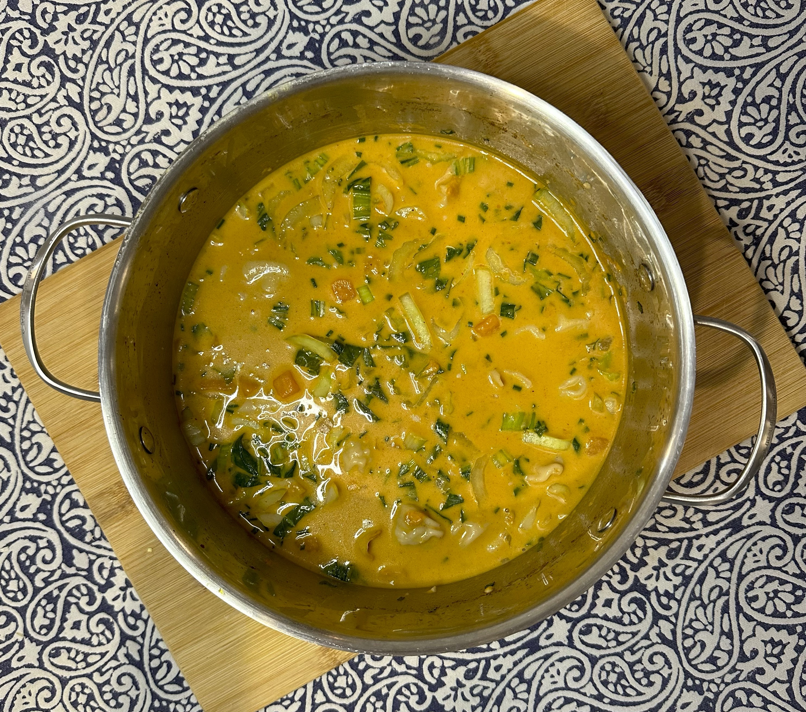

# My Latest Meal

Made some curried wonton soup! (instructions below)

[]{align="left": style="height:150;width:150px"}

Ingredients:
- 1 onion (diced)
- 1 sweet potato (cut into centimetre-sized cubes)
- Olive oil
- 4 cloves of garlic (minced)
- 1 small knob of ginger (minced)
- 3-6tbsp of red curry paste
- 3 1/2 cups of light coconut milk (approx 2 standard cans)
- 2 cups of water
- 2tsp chicken bouillon powder
- Salt
- Pepper
- 2 cups of frozen wontons
- 3 bunches of baby bok choy (chopped)
- 3 spring onions (diced)

1. Heat olive oil in pot on medium heat. Stir in onions and sweet potatoes, season with salt and cook until onions are transluscent, about 8 minutes.
2. Add garlic and ginger and cook until fragrant, about 30 seconds.Then, add curry paste and cook until fragrant, about 30 seconds.
3. Add coconut milk, water, and chicken bouillon powder; season with salt and pepper to taste, and bring to boil.
4. Add wontons, and cook uncovered for 6 minutes, or until wontons are cooked through.
5. Reduce heat to low, add bok choy and spring onions.
6. Serve hot!
