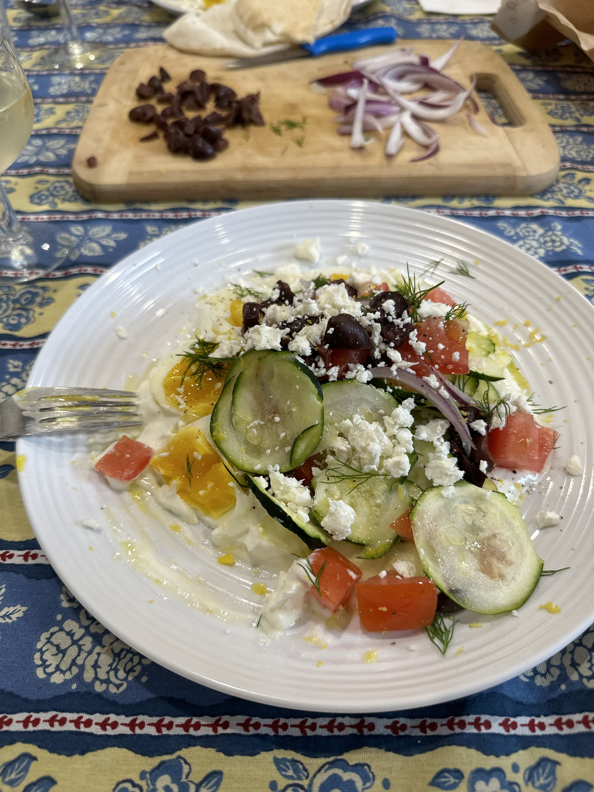

# Lockdown Hobbies

My passion for cooking started the way it began for many - during the pandemic, when there was not much else to do! First, it was baking, with some of my most notable desserts being a classic tiramisu and a decadent 3-layer black forest cake, but my horizons soon grew as I began to explore the world of cooking.

My favourite cuisines to make are Italian and Japanese - I make a mean carbonara (if I do say so myself). I hope to continue sharpening my culinary skills and who knows, maybe some day I'll be known as the Astronomy Chef!

{align="left": style="height:230;width:230px"}
{align="left": style="height:320;width:320px"}
{align="left": style="height:340;width:340px"}

             

# My Latest Meal

Made some curried wonton soup! (instructions below)

**Ingredients:**

- 1 onion (diced)

- 1 sweet potato (cut into centimetre-sized cubes)

- Olive oil

- 4 cloves of garlic (minced)

- 1 small knob of ginger (minced)

- 3-6 tbsp of red curry paste

- 3 1/2 cups of light coconut milk (approx 2 standard cans)

- 2 cups of water

- 2 tsp chicken bouillon powder

- Salt

- Pepper

- 2 cups of frozen wontons

- 3 bunches of baby bok choy (chopped)

- 3 spring onions (diced)

**Instructions:**

1. Heat olive oil in pot on medium heat. Stir in onions and sweet potatoes, season with salt and cook until onions are transluscent, about 8 minutes.
2. Add garlic and ginger and cook until fragrant, about 30 seconds.Then, add curry paste and cook until fragrant, about 30 seconds.
3. Add coconut milk, water, and chicken bouillon powder; season with salt and pepper to taste, and bring to boil.
4. Add wontons, and cook uncovered for 6 minutes, or until wontons are cooked through.
5. Reduce heat to low, add bok choy and spring onions.
6. Serve hot!

 

[Back to About Me](./index.md)
