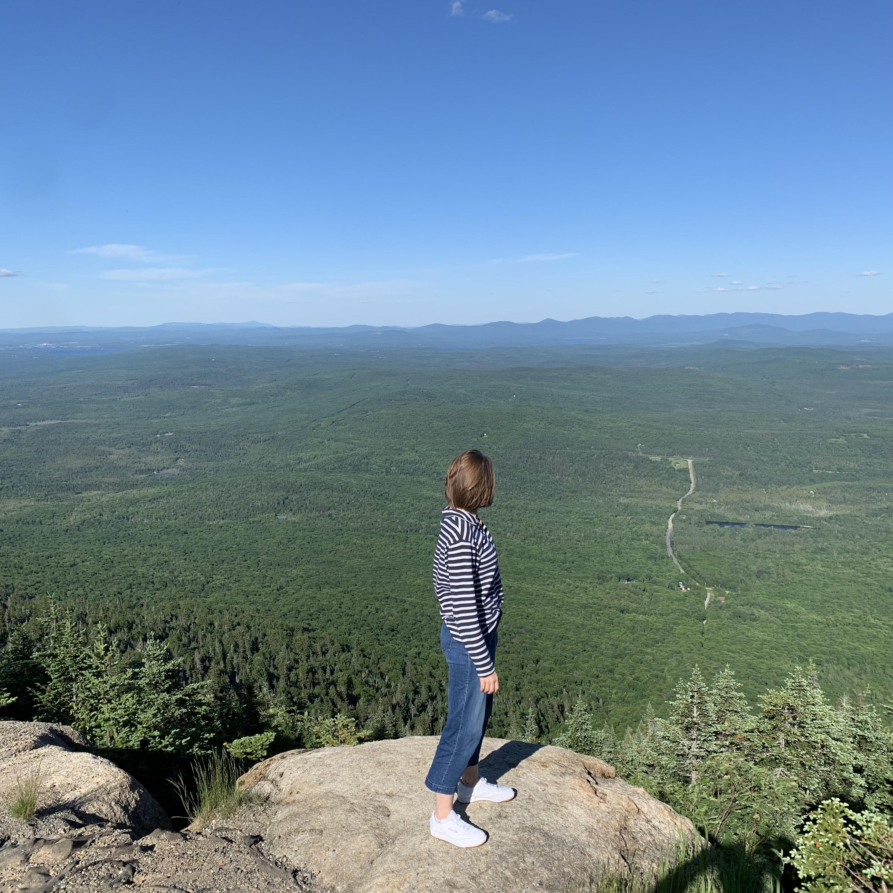

My name is Rebecca, I'm a first year master's student in Physics and Astronomy at McGill University. I'm also a member of the Trottier Space Institute (TSI). Working under the supervision of [Dr. Daryl Haggard](https://www.dhaggard.physics.mcgill.ca/) (McGill) and [Dr. John Ruan](https://gamma-research.space/) (Bishop’s), I study transients - short-lived cosmic events. I'm interested in gravitational wave (GW) sources, notably neutron star-neutron star (NS-NS) and black hole-neutron star (BH-NS) merger events, also known as kilonovae.

# Outreach

I am also very passionate about science communication and outreach! My outreach journey began in 2021 when I worked as an astronomy presenter at the [Parc National du Mont Mégantic](https://www.sepaq.com/pq/mme/astrolab.dot?language_id=1) ASTROLab. Combining my love for the outdoors with my enthusiasm for space, I led observatory tours that introduced visitors to the night sky. Watching the awe in people’s faces, especially the youngest stargazers, sparked a deep appreciation for inspiring others. 

In 2022, I took on a new role with the Canadian Space Agency’s proposed [Cosmological Advanced Survey Telescope for Optical and ultraviolet Research](https://www.castormission.org/) (CASTOR) mission. I managed the science communication for CASTOR, producing a series of video interviews that highlighted team members across different fields. 

I was also the recipient of the 2023 [Trottier Institute for Research on Exoplanets](https://exoplanetes.umontreal.ca/en/) (IREx) Sureau Science Communication Grant and had the chance to work closely with [Dr. Nathalie Nguyen-Quoc Ouellette](https://www.astropanda.space/). These experiences have solidified my dedication to bridging complex science with public understanding, showing me the value of communication in making astronomy accessible.

# EDIA

In addition, I am also passionate about advancing equity, diversity, inclusion, and accessibility (EDIA) in STEM. Over the span of 11 months, I contributed to [Parité Sciences](https://www.paritesciences.ca/en), a Quebec-based initiative aimed at reducing gender disparities in STEM fields. My role included survey analysis and outreach to extend Parité’s mission beyond Quebec. This experience inspired me to launch an EDIA initiative within my department at Saint Mary’s University, which remains active today.

{align="left": style="height:240;width:240px"}
{align="left": style="height:310;width:310px"}
{align="left": style="height:240;width:240px"}
{align="right": style="height:450;width:450px"}
{align="right": style="height:250;width:250px"}

                        

# My Hobbies

In my personal time, I enjoy many hobbies, mainly cooking, reading, and taking care of my plants! If you're interested in peering into my non-academic life, click below:

- [Cooking](./cooking.md)

- [Reading](./reading.md)

- [Plants](./plants.md)

