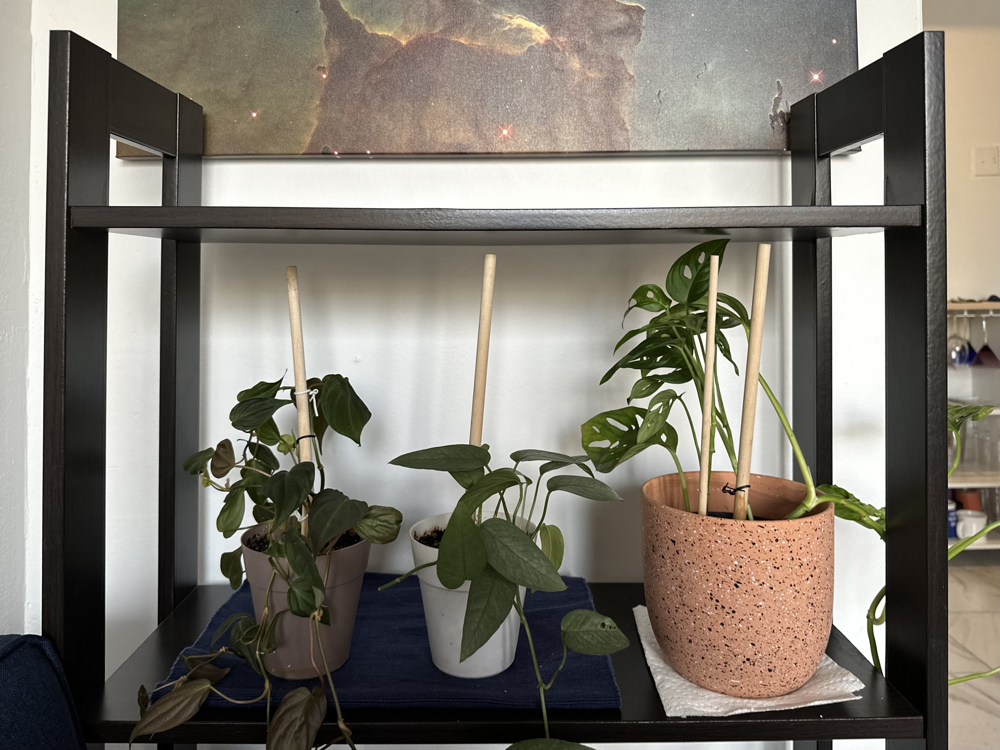

# My Green Thumb

In my opinion, plants are the best type of medicine - especially in Montreal! Surrounding myself with greenery helps me relax, claim my space, and pour my time and effort into making something grow and flourish! My collection is still small, but I hope to collect many plants and turn my apartment into a tiny jungle!

Here's a few plants I saved recently from the side of the road: The two plants on the left are heartleaf philohendrons (philohendron hederaceum) and a Adanson's monstera (monstera adansonii)

 

[Back to About Me](./index.md)
